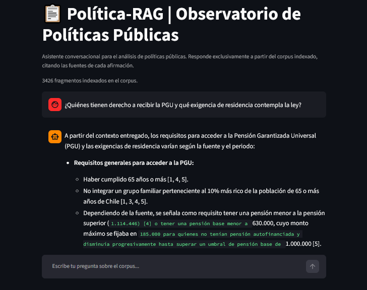
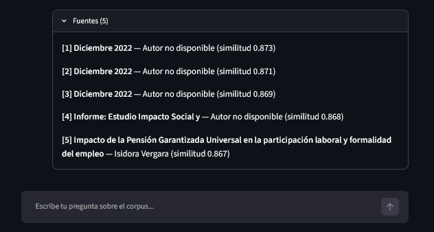
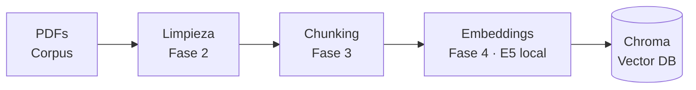
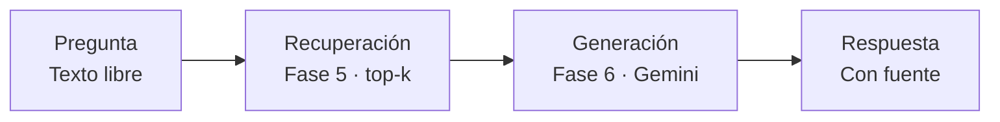

# Política-RAG — Asistente conversacional para el análisis de políticas públicas

Sistema de **Retrieval-Augmented Generation (RAG)** construido desde cero,
sin frameworks de por medio, para consultar en lenguaje natural el proceso legislativo y el debate en torno a una política pública específica — con cada afirmación citada a la fuente exacta de donde salió. Nunca responde "de memoria": si la información no está en el corpus indexado, lo dice explícitamente en vez de inventar.

**Corpus de demostración actual**: Marco normativo y literatura de evaluación de la Pensión Garantizada Universal (PGU) en Chile, incluyendo la Ley N° 21.419 de 2022, informes legislativos sobre la transición del Pilar Solidario y estudios de impacto socio-laboral. Pero, cabe señalar que **la arquitectura es agnóstica al contenido**, es decir, se puede modificar el contenido según la finalidad.

  


  
  
## Motivación
 
Seguir el debate legislativo sobre una política pública en profundidad es
lento: requiere leer el proyecto de ley original, sus modificaciones,
informes de comisión, y comentarios especializados de posturas distintas —
todo disperso en decenas de documentos. Este proyecto responde a dos
necesidades:
 
1. **Utilidad práctica real**: un asistente que permite preguntar en
   lenguaje natural qué dice o cómo evolucionó una política específica,
   con cada afirmación trazable a su fuente exacta — útil para cualquiera
   que necesite seguir un debate legislativo sin releer documento por
   documento (periodistas, investigadores, ciudadanía informada).
2. **Manejo demostrable de IA generativa aplicada**: LLMs vía API, prompt
   engineering orientado a evitar alucinaciones, arquitectura RAG y
   evaluación automatizada — aplicado a un dominio de interés general,
   no solo académico.


## Por qué RAG y no "pegarle los PDFs a un chat"

Pegar el texto completo de varios documentos en cada conversación con un
LLM tiene tres problemas: el contexto se llena rápido y sale caro en
tokens en cada pregunta, no hay manera de saber de qué documento exacto
salió una afirmación, y el modelo puede "completar" con conocimiento
propio en vez de ceñirse a los documentos (alucinación). El RAG resuelve
los tres: indexa el corpus una sola vez, recupera solo los fragmentos
relevantes para cada pregunta, y obliga al modelo a responder basado en
esos fragmentos, citándolos.

## Arquitectura

El sistema tiene dos pipelines independientes:

**Indexación** (offline, se corre una vez por documento nuevo):



**Consulta** (online, se corre en cada pregunta del usuario):



## ¿Para qué más sirve esto?

La única variable que cambia entre un dominio y otro es **qué PDFs hay en
`data/raw/`**. Cambiar de tema no requiere tocar código — solo reemplazar
los documentos y volver a correr el pipeline de indexación (ver
[Cómo cambiar de corpus](#cómo-cambiar-de-corpus-o-de-tema)). Con eso, esta
misma arquitectura sirve, sin modificaciones, para:

- **Revisión de literatura académica en cualquier disciplina**: cargar
  10, 20 o 50 papers sobre un tema de investigación y consultarlos en
  lenguaje natural, con cada afirmación citada a su fuente exacta —
  acelera el trabajo de estado del arte de una tesis o una publicación.
- **Documentación normativa o procedimientos internos de una
  organización**: manuales, políticas, normativa regulatoria — un
  asistente que responde preguntas de un equipo citando el documento y la
  sección exacta, en vez de que cada persona busque manualmente en
  decenas de PDFs.
- **Informes de gestión históricos**: actas, memorias anuales, reportes
  de proyectos anteriores — consultar "qué se decidió sobre X" sin releer
  documento por documento.
- **Análisis de contenido temático a mayor escala**: con 10, 50 o más
  documentos sobre una misma temática (cobertura de prensa, discursos,
  actas de sesiones), permite hacer preguntas agregadas — "¿qué posturas
  distintas aparecen sobre X?" — con trazabilidad completa a la fuente.

Esta arquitectura funciona bien tal cual para corpus de decenas a un par
de miles de fragmentos. Para volúmenes mucho mayores, el punto de partida
para escalar está señalado en el propio código: `embed.py` reconstruye la
colección completa en cada corrida (simple y seguro a esta escala); un
corpus mucho más grande cambiaría eso por una actualización incremental.

## Decisiones de diseño

- **Embeddings locales (E5 multilingüe) en vez de una API de embeddings**:
  no depende de un servicio externo, no tiene costo por documento
  indexado, y evita enviar el contenido íntegro de los documentos a un
  tercero — un argumento de privacidad de datos defendible en cualquier
  entrevista, y relevante de verdad si el corpus fuera normativa interna
  confidencial de una organización.
- **Gemini solo para la generación, no para los embeddings**: separa
  responsabilidades. El modelo generativo entra únicamente en la última
  etapa, así que su costo se limita a las preguntas efectivamente hechas,
  no a indexar el corpus completo.
- **Chroma como base vectorial**: no requiere servidor, corre localmente
  en un archivo, y es la opción estándar para un proyecto de este tamaño.
- **Construcción desde cero en vez de un framework como LangChain**: el
  objetivo es entender y poder explicar cada pieza del pipeline sin que
  quede oculta detrás de abstracciones.
- **Prompt con grounding explícito**: el modelo tiene prohibido completar
  con conocimiento propio, y debe admitir cuando el contexto no alcanza
  para responder — la mitigación de alucinaciones vive en el diseño del
  prompt, no como una ocurrencia tardía.
- **Reintentos ante errores transitorios del proveedor**: `generate.py`
  reintenta con espera creciente ante caídas puntuales de disponibilidad
  del modelo (algo real y documentado en la práctica de este proyecto),
  en vez de fallar de inmediato.

## Instalación

**Opción A — GitHub Codespaces (recomendado si tu equipo tiene poca RAM):**
el repo incluye `.devcontainer/devcontainer.json`, que deja el entorno
listo automáticamente (dependencias instaladas, tokenizador de NLTK
descargado, `.env` creado desde la plantilla) al crear un Codespace desde
GitHub ("Code" → "Codespaces" → "Create codespace on main"). Después de
creado, solo falta pegar tu clave real de Gemini en el `.env` y subir tus
PDFs a `data/raw/` (ninguno de los dos viaja por git).

**Opción B — local:**
```bash
git clone <tu-repo>
cd sociolit-rag
python -m venv venv
source venv/bin/activate       # En Windows: venv\Scripts\activate
pip install -r requirements.txt
cp .env.example .env
# Edita .env y pega tu clave gratuita de https://aistudio.google.com/apikey
```

## Uso

```bash
python src/ingest.py     # Fase 2 — extrae y limpia el texto de data/raw/
python src/chunk.py      # Fase 3 — trocea el texto en fragmentos
python src/embed.py      # Fase 4 — genera embeddings e indexa en Chroma
python src/retrieve.py   # Fase 5 — prueba solo la recuperación (sin LLM)
python src/generate.py   # Fase 6 — pregunta/respuesta completa, con citas
python src/evaluate.py   # Fase 7 — corre la batería de casos de prueba
streamlit run app.py     # Fase 8 — interfaz de chat
```

### Cómo cambiar de corpus o de tema

1. Borra los PDFs anteriores de `data/raw/` **y también** los `.json` que
   `ingest.py` generó para ellos en `data/processed/` (además de
   `chunks.jsonl` si existe) — `chunk.py` toma todo lo que encuentre ahí,
   sin importar si el PDF original sigue existiendo.
2. Copia los PDFs nuevos a `data/raw/`.
3. Vuelve a correr `ingest.py` → `chunk.py` → `embed.py` en ese orden.
   `embed.py` reconstruye la colección de Chroma completa cada vez, así
   que no queda ningún fragmento del corpus anterior mezclado.
4. Actualiza `tests/casos_prueba.py` con preguntas reales del tema nuevo
   antes de correr `evaluate.py`.

## Estructura del proyecto

```
sociolit-rag/
├── .devcontainer/
│   └── devcontainer.json  # Configuración de GitHub Codespaces
├── data/
│   ├── raw/          # PDFs originales (NO se sube a git — ver nota de derechos de autor)
│   └── processed/    # Texto limpio extraído y chunks.jsonl
├── src/
│   ├── config.py     # Configuración central (rutas, modelos, parámetros)
│   ├── ingest.py     # Fase 2 — extracción y limpieza de PDFs
│   ├── chunk.py      # Fase 3 — troceo de texto
│   ├── embed.py      # Fase 4 — embeddings y carga a Chroma
│   ├── retrieve.py   # Fase 5 — recuperación semántica
│   ├── generate.py   # Fase 6 — prompt + LLM + citas (con reintentos)
│   └── evaluate.py   # Fase 7 — evaluación automatizada
├── notebooks/        # Exploración y validación manual de cada fase
├── tests/
│   └── casos_prueba.py  # Fase 7 — preguntas de prueba y control de alucinaciones
├── app.py            # Fase 8 — interfaz de chat en Streamlit
├── requirements.txt
├── .env.example
└── README.md
```

## Evaluación y control de alucinaciones

`tests/casos_prueba.py` define dos tipos de caso: preguntas dentro del
corpus (con palabras clave que la respuesta debería mencionar) y preguntas
fuera de alcance (donde se espera que el sistema admita que no sabe).
`python src/evaluate.py` corre la batería completa y da un resumen
pasa/no pasa — una forma repetible de detectar si un cambio (el prompt, el
top_k, el modelo) rompió algo que antes funcionaba.

## Limitaciones conocidas

- La recuperación usa un índice aproximado (HNSW); en corpus muy chicos
  esto puede alterar levemente el orden entre resultados muy cercanos
  entre sí, sin impacto práctico en la respuesta final.
- La evaluación automatizada (Fase 7) usa coincidencia léxica simple, no
  una métrica semántica — suficiente para detectar una regresión evidente,
  no para una auditoría exhaustiva de calidad.
- La extracción de columnas en PDFs (Fase 2) es una heurística basada en
  detectar el espacio en blanco entre columnas; layouts muy atípicos
  (tres o más columnas, tablas complejas) pueden requerir ajustes.
- La generación depende de la disponibilidad del proveedor del LLM
  (mitigado parcialmente con reintentos, no eliminado del todo).

## Nota sobre derechos de autor

Los PDFs de papers académicos casi siempre tienen copyright. `data/raw/`
está en `.gitignore` a propósito: el repositorio público en GitHub
contiene el pipeline (el código), no los documentos. Para mostrar el
proyecto funcionando sin exponer texto con copyright: corre la demo en
vivo con tu propia carpeta local, o arma un corpus de prueba con
documentos de acceso abierto que sí puedas incluir o referenciar
libremente.

## Autor

Cristian Riquelme — [GitHub: CristianRiquelmeF](https://github.com/CristianRiquelmeF)
Sociólogo y Analista de Datos/BI.
